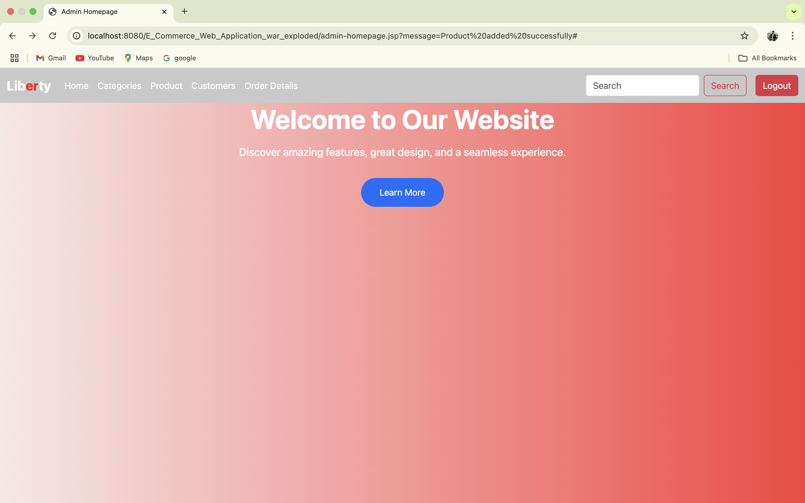
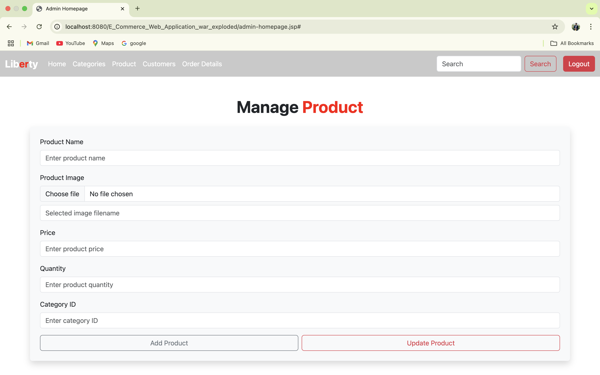
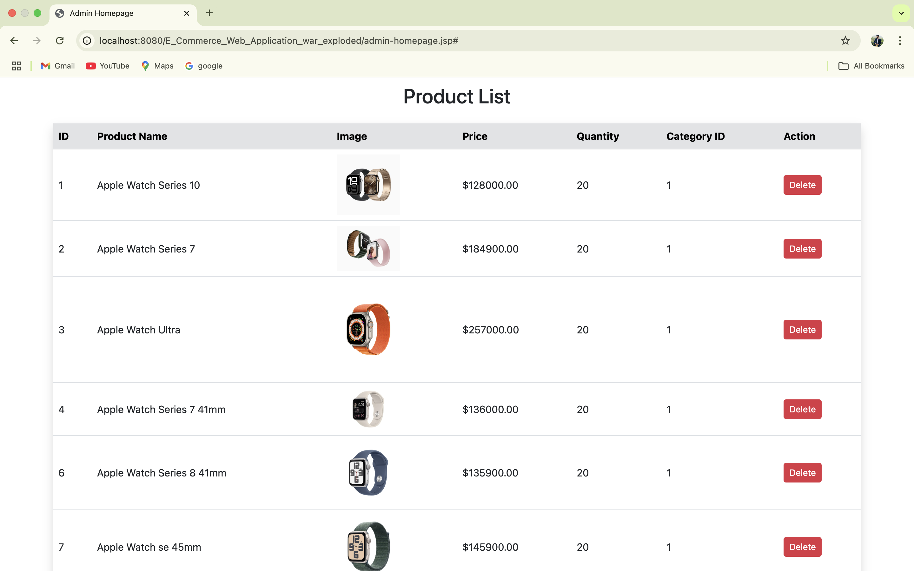
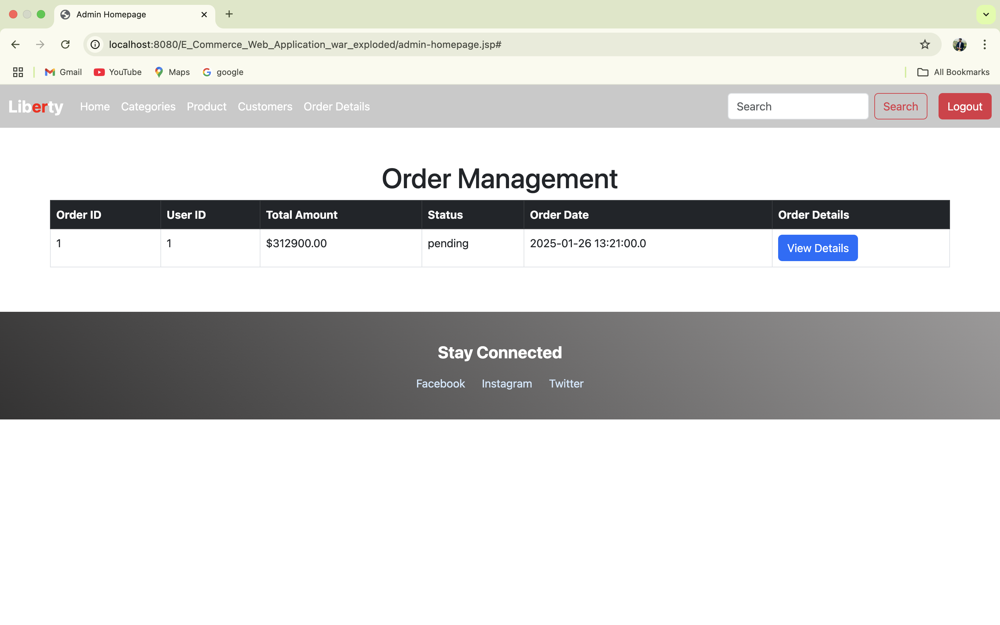
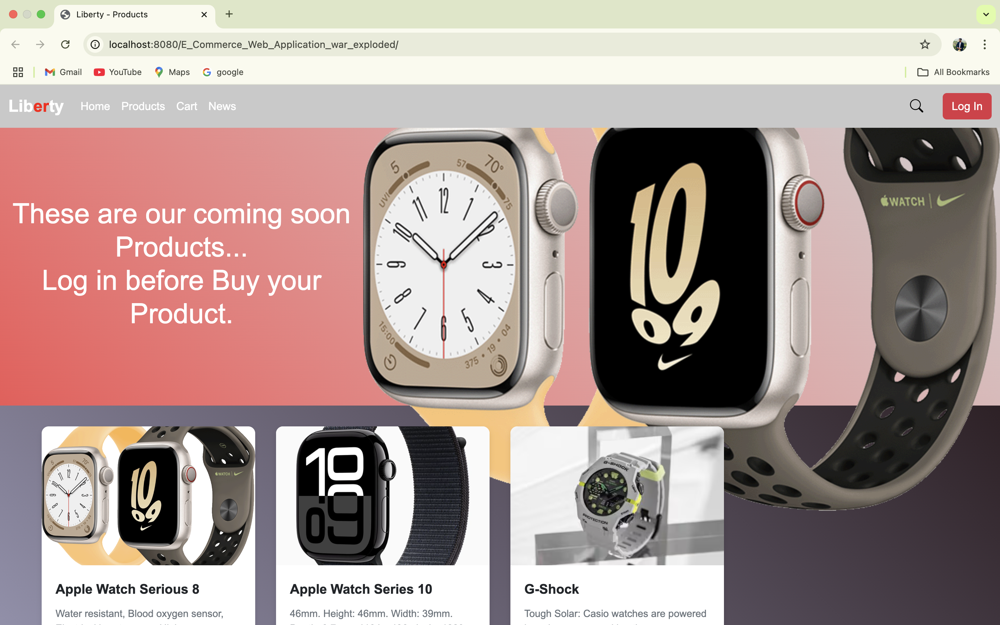
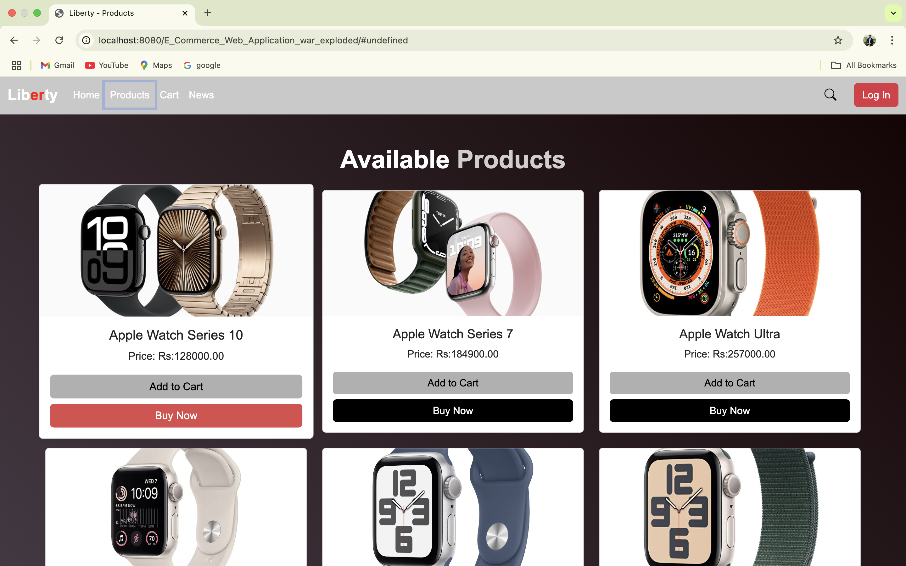
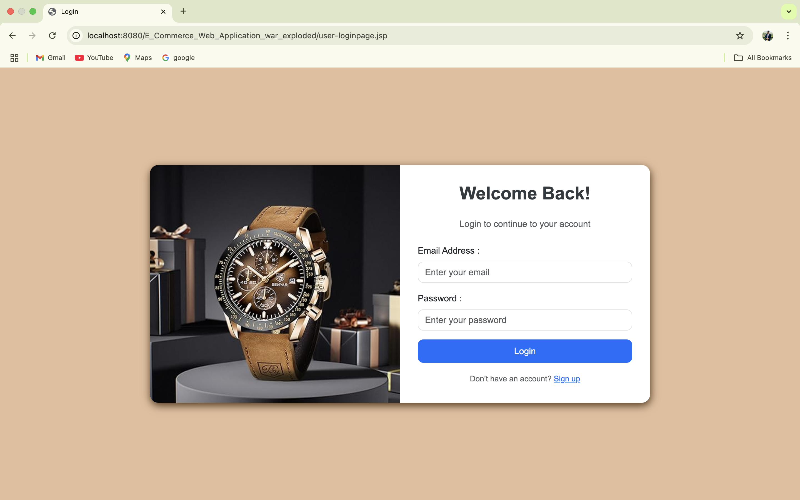
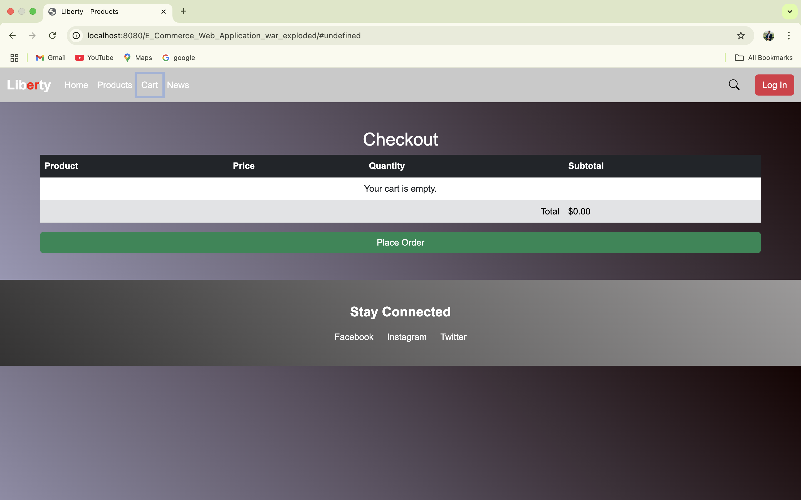
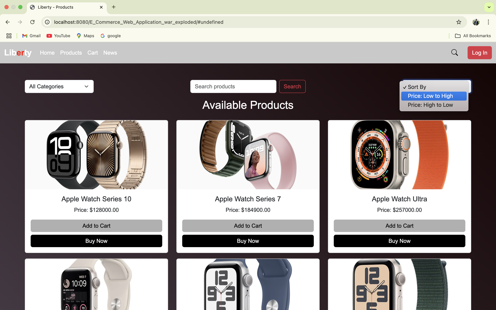
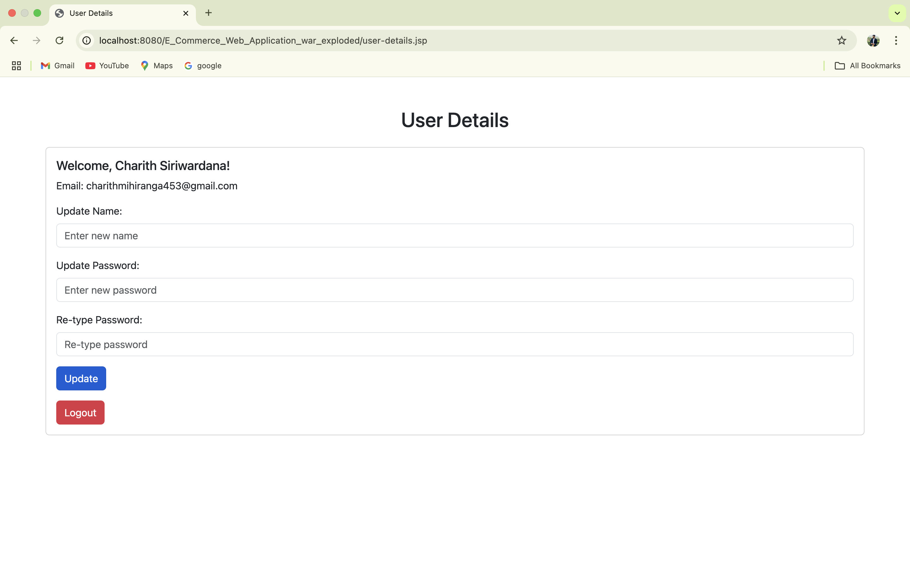

# E-Commerce-Web-Application-Assingment-01

This application is designed to provide a seamless user experience by combining modern front-end and back-end technologies. The front-end is built using JSP, HTML, CSS, JavaScript, and Bootstrap, ensuring a responsive and visually appealing interface. The back-end leverages the power of MySQL for efficient data storage and retrieval, while Java and Jakarta EE handle the application logic and server-side processing. This technology stack ensures the application is both robust and scalable, meeting modern web development standards and providing an intuitive user experience.

🔴Administrator Functions

⭕️Admin Homepage

⭕️Admin Category Page

⭕️Admin Product Page

⭕️Admin Product List

⭕️Admin Order Management Page

🔴Customer Functions

⭕️Customer Homepage

⭕️Customer Product Page

⭕️Customer Login page

⭕️Customer Cart Page

⭕️Customer Product Search Page

⭕️Customer Personal details Update Page

▶️Video Demonstration on Youtube :- https://youtu.be/dh-sZJ-4Ay0

